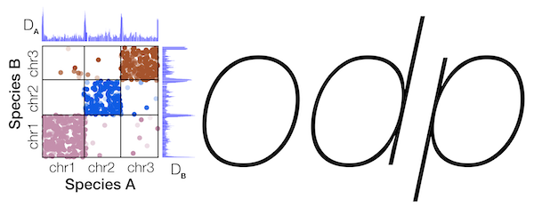

# odp - Oxford Dot Plots

This software creates dotplots of protein synteny in genome assemblies. This software was modelled on the dotplots found in [Simakov, Oleg, et al. "Deeply conserved synteny resolves early events in vertebrate evolution." Nature ecology & evolution 4.6 (2020): 820-830.](https://www.nature.com/articles/s41559-020-1156-z)
